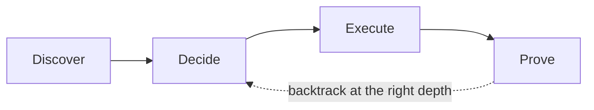

# ThoughtLoop

**Deliberate problem solving for coding agents.**

[](https://github.com/daeon/thoughtloop/actions/workflows/validate.yml)
[](https://github.com/daeon/thoughtloop/stargazers)
[](LICENSE)
[](.codex-plugin/plugin.json)
[](https://github.com/daeon/thoughtloop)

> **Think wider. Build better. Prove it.**

ThoughtLoop is a composable Codex skill pack for solving important tasks without rushing to the first plausible answer or verifying forever. It searches when alternatives matter, challenges weak framing, makes tradeoffs explicit, executes economically, and checks the result with independent evidence.

The architecture is intentionally simple:

```text
Discover -> Decide -> Execute -> Prove
```

The stages are adaptive guidance, not a mandatory ceremony. Small tasks stay small. High-risk work gets deeper discovery and stronger proof.

## Table of contents

- [Why ThoughtLoop](#why-thoughtloop)
- [How it works](#how-it-works)
- [What's included](#whats-included)
- [Subagent mode](#subagent-mode)
- [Quick start](#quick-start)
- [Install](#install)
- [Validate](#validate)
- [Compatibility](#compatibility)
- [Roadmap](#roadmap)
- [Contributing](#contributing)
- [Security](#security)
- [License](#license)
- [Acknowledgments](#acknowledgments)

## Why ThoughtLoop

Coding agents tend to fail in two opposite ways: they patch the first plausible idea, or they spend too long exploring without converging. ThoughtLoop gives the agent a small set of boundaries that keep judgment proportional to the task.

| Problem | ThoughtLoop response |
|---|---|
| The first solution looks plausible | Search distinct solution families when the choice matters. |
| A hidden assumption drives the design | Challenge the framing before commitment. |
| A failed test leads to another random patch | Route the failure to implementation, strategy, assumptions, evidence, or escalation. |
| Confidence is mistaken for correctness | Require observable evidence and preserve `UNKNOWN` when evidence is missing. |
| Delegation burns budget without adding signal | Use narrow, fresh-context subagents only when the accuracy benefit justifies the cost. |

## How it works



The four stages answer different questions:

1. **Discover:** Which materially different approaches or explanations are worth considering?
2. **Decide:** What should we do next, and which tradeoffs or unknowns could change that choice?
3. **Execute:** What is the smallest coherent change that satisfies the contract?
4. **Prove:** What evidence supports the result, what failed, and what remains unknown?

## What's included

| Stage | Skill | Purpose |
|---|---|---|
| Orchestration | `thoughtloop` | Routes the appropriate amount of search, execution, proof, correction, and optional delegation. |
| Compatibility | `self-correction` | Deprecated explicit alias that redirects to `thoughtloop`. |
| Discover | `explorer` | Covers materially different solution families. |
| Discover | `challenger` | Tests framing and inherited assumptions before commitment. |
| Decide | `synthesizer` | Chooses, combines, or experimentally distinguishes approaches. |
| Execute | `builder` | Implements the selected strategy or a targeted revision. |
| Control | `revision-manager` | Routes failures to the level that is actually wrong. |
| Prove | `ground-truth-verifier` | Collects independent evidence. |
| Prove | `judge` | Applies `PASS`, `FAIL`, or `UNKNOWN` to criteria. |
| Prove | `adversarial-review` | Looks for hidden defects after ordinary checks. |
| Meta | `loop-evaluator` | Measures loop quality, evidence quality, and budget use. |

Only `thoughtloop` permits implicit invocation. The other skills are explicit by default, so they do not trigger on unrelated work.

## Subagent mode

Subagent mode is opt-in and budget-aware:

```text
$thoughtloop --subagents --budget=balanced Redesign this caching layer.
```

The parent agent keeps ownership of the contract, decisions, edits, evidence synthesis, and final result. Delegated work stays narrow and starts with fresh context. Use lower-cost agents for bounded search or mechanical checks; reserve stronger reasoning for difficult tradeoffs, disagreements, and final decisions.

| Budget | Starting shape | Good fit |
|---|---|---|
| `light` | One narrow subtask | A focused inspection or first-pass review. |
| `balanced` | Up to two complementary subtasks | A moderate design choice or search-plus-review. |
| `deep` | Up to three complementary subtasks and one follow-up round | High-risk work with competing approaches or disputed evidence. |

Delegation is never required. If it cannot add independent signal, keep the work in the parent agent.

## Quick start

Invoke the orchestrator inside Codex:

```text
$thoughtloop Reduce p99 latency in this parsing service without changing its external contract. Explore materially different approaches only if they could change the result, then implement and prove the choice.
```

Use a specialist directly when you want one stage:

```text
$explorer Search for materially different ways to reduce p99 latency.
$challenger Challenge the assumptions behind this architecture.
$ground-truth-verifier Verify whether this implementation satisfies the stated behavior.
$adversarial-review Try to break this refactor after its ordinary tests pass.
```

See the [`examples/`](examples/) directory for coding, research, and constrained-writing workflows.

## Install

### As a Codex plugin

This repository is packaged as a skills-only plugin. The manifest is at [`.codex-plugin/plugin.json`](.codex-plugin/plugin.json), and the local marketplace entry is at [`.agents/plugins/marketplace.json`](.agents/plugins/marketplace.json).

Install it using your Codex plugin workflow, then invoke `$thoughtloop` in a task that benefits from deliberate search and verification.

### As standalone local skills

Codex discovers user skills from `$HOME/.agents/skills`. Install all skills from this checkout with:

```bash
python scripts/install_local.py
```

Use `--copy` for independent copies and `--force` to replace existing skill paths. Remove the installed skills with:

```bash
python scripts/uninstall_local.py
```

## Validate

Run the pack checks locally:

```bash
python tests/validate_pack.py
python skills/loop-evaluator/scripts/calculate_metrics.py examples/sample-loop-log.jsonl
```

The validator uses only the Python standard library. The metrics script reports signals such as exploration, revisions, regressions, unknowns, cost, tokens, and runtime. Treat those metrics as diagnostic signals, not as a single quality score.

The same checks run in [GitHub Actions](.github/workflows/validate.yml) for pushes and pull requests.

## Compatibility

`$self-correction` remains a deprecated, explicit-only alias for older workflows. New integrations should call `$thoughtloop` directly.

## Roadmap

ThoughtLoop is deliberately small. The next useful improvements are:

- expand examples for migrations, performance work, and operational debugging;
- add more labeled evaluation fixtures for delegation and failure-depth routing;
- publish tagged releases as the pack's contracts stabilize.

Open an issue if you have a concrete use case or evidence that should change the design.

## Contributing

See [`CONTRIBUTING.md`](CONTRIBUTING.md) for the repository invariants, validation commands, and pull request expectations.

## Security

ThoughtLoop contains instructions that can influence an agent's actions. Do not add secrets, private logs, credentials, or untrusted instructions to skills or examples. See [`SECURITY.md`](SECURITY.md) before reporting a security concern.

## License

ThoughtLoop is released under the MIT License. See [`LICENSE`](LICENSE).

## Acknowledgments

The README structure was adapted from [Best-README-Template](https://github.com/othneildrew/Best-README-Template), one of the most widely used README templates on GitHub. The ThoughtLoop content, workflow contracts, and validation tools are specific to this project.

[Back to top](#thoughtloop)
