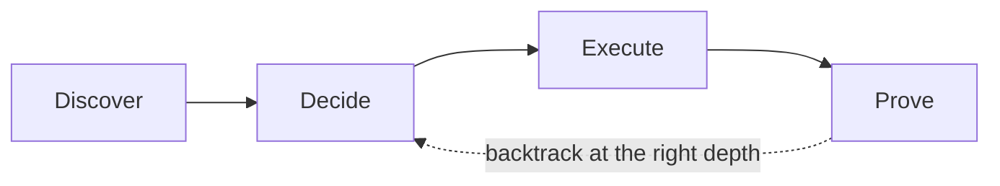
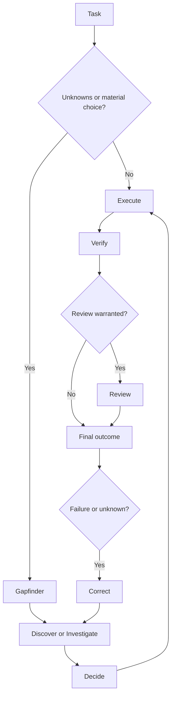

# ThoughtLoop

**Deliberate problem solving for coding agents.**

[](https://github.com/daeon/thoughtloop/actions/workflows/validate.yml)
[](https://github.com/daeon/thoughtloop/stargazers)
[](LICENSE)
[](.codex-plugin/plugin.json)
[](https://github.com/daeon/thoughtloop)

> **Think wider. Build better. Prove it.**

ThoughtLoop is one installable Codex skill pack with one adaptive orchestrator, shared graph contracts, and independently callable capability nodes. It searches when alternatives matter, makes tradeoffs explicit, executes economically, and proves results with independent evidence.

The architecture is intentionally simple:

```text
Discover -> Decide -> Execute -> Prove
```

The stages are adaptive guidance, not a mandatory ceremony. Small tasks stay small. High-risk work gets deeper discovery and stronger proof.

## Table of contents

- [Why ThoughtLoop](#why-thoughtloop)
- [Canonical graph](#canonical-graph)
- [How it works](#how-it-works)
- [Independent nodes](#independent-nodes)
- [What's included](#whats-included)
- [Subagent mode](#subagent-mode)
- [Quick start](#quick-start)
- [Install](#install)
- [Validate](#validate)
- [Roadmap](#roadmap)
- [Contributing](#contributing)
- [Security](#security)
- [License](#license)
- [Acknowledgments](#acknowledgments)

## Why ThoughtLoop

Coding agents tend to fail in two opposite ways: they patch the first plausible idea, or they spend too long exploring without converging. ThoughtLoop gives the agent a small set of boundaries that keep judgment proportional to the task.

| Problem | ThoughtLoop response |
|---|---|
| The first solution looks plausible | Search distinct solution families when the choice matters. |
| A hidden assumption drives the design | Challenge the framing before commitment. |
| A failed test leads to another random patch | Route the failure to implementation, strategy, assumptions, evidence, or escalation. |
| Confidence is mistaken for correctness | Require observable evidence and preserve `UNKNOWN` when evidence is missing. |
| Delegation burns budget without adding signal | Use narrow, fresh-context subagents only when the accuracy benefit justifies the cost. |

## How it works



The four stages answer different questions:

1. **Discover:** Which materially different approaches or explanations are worth considering?
2. **Decide:** What should we do next, and which tradeoffs or unknowns could change that choice?
3. **Execute:** What is the smallest coherent change that satisfies the contract?
4. **Prove:** What evidence supports the result, what failed, and what remains unknown?

## Canonical graph



The graph is a set of reusable public nodes plus internal operations owned by
the orchestrator. The installed contracts in
[`skills/thoughtloop/references/contracts.md`](skills/thoughtloop/references/contracts.md)
carry observable state; the installed routing policy in
[`skills/thoughtloop/references/routing.md`](skills/thoughtloop/references/routing.md)
defines the boundaries.

### Canonical nodes

| Node | Responsibility |
|---|---|
| `thoughtloop` | Adaptive routing, execution gates, proof, correction, and delegation |
| `gapfinder` | Expensive unknowns and discovery-depth selection |
| `discover` | Solution search, framing challenge, and disposable prototypes |
| `investigate` | Repository, debugging, log, and performance forensics |
| `decide` | Evidence-backed selection and risk-first planning |
| `verify` | Independent evidence collection |
| `review` | Post-check red-team review |
| `handoff` | Compact continuation state |

Execution, final judgment, correction, and loop evaluation are internal
operations owned by `thoughtloop`, not separately installed skills.

## Independent nodes

Every canonical node can be invoked directly when a task needs one capability.
The node can also receive state from `thoughtloop` through the shared contracts.
There is one public name per responsibility; modes belong inside the owning
node rather than being exposed as duplicate compatibility skills.

## What's included

| Stage | Skill | Purpose |
|---|---|---|
| Orchestration | `thoughtloop` | Routes the appropriate amount of search, execution, proof, correction, and optional delegation. |
| Discover | `gapfinder`, `discover` | Finds expensive unknowns, searches options, challenges framing, and probes concrete alternatives. |
| Investigate | `investigate` | Maps repositories, debugs failures, analyzes logs, and measures performance without editing by default. |
| Decide | `decide` | Selects an approach or creates a risk-first implementation plan. |
| Execute | internal `execute` | Implements the selected strategy or a targeted revision. |
| Prove | `verify`, `review`, internal `final-judgment` | Collects evidence, red-teams high-risk results, and applies criterion-level outcomes. |
| Continuity | `handoff` | Preserves compact state for another agent or session. |
| Meta | internal evaluation | Measures loop quality, evidence quality, and budget use. |
| Public surface | 8 skills | Keeps focused calls independently usable while preserving one graph vocabulary. |

Only `thoughtloop` permits implicit invocation. Its boundary is consequential,
decision-sensitive coding work—not coding vocabulary alone. Simple explanations,
formatting, trivial edits, routine commands, and tasks already governed by a
more specific skill remain explicit or stay with the more specific skill.

## Subagent mode

Subagent mode is opt-in and budget-aware:

```text
$thoughtloop Use bounded subagents with a balanced budget to redesign this caching layer.
```

The parent agent keeps ownership of the contract, decisions, edits, evidence synthesis, and final result. Delegated work stays narrow and starts with fresh context. Use lower-cost agents for bounded search or mechanical checks; reserve stronger reasoning for difficult tradeoffs, disagreements, and final decisions.

| Budget | Starting shape | Good fit |
|---|---|---|
| `light` | One narrow subtask | A focused inspection or first-pass review. |
| `balanced` | Up to two complementary subtasks | A moderate design choice or search-plus-review. |
| `deep` | Up to three complementary subtasks and one follow-up round | High-risk work with competing approaches or disputed evidence. |

Delegation is never required. If it cannot add independent signal, keep the work in the parent agent.

## Quick start

Invoke the orchestrator inside Codex:

```text
$thoughtloop Reduce p99 latency in this parsing service without changing its external contract. Explore materially different approaches only if they could change the result, then implement and prove the choice.
```

Use a specialist directly when you want one stage:

```text
$discover Search for materially different ways to reduce p99 latency.
$investigate Measure the performance bottleneck without editing the repository.
$verify Verify whether this implementation satisfies the stated behavior.
$review Try to break this refactor after its ordinary tests pass.
```

See the [`examples/`](examples/) directory for coding, research, and constrained-writing workflows.

## Install

### As a Codex plugin

This repository is packaged as a skills-only plugin. The manifest is at [`.codex-plugin/plugin.json`](.codex-plugin/plugin.json), and the local marketplace entry is at [`.agents/plugins/marketplace.json`](.agents/plugins/marketplace.json).

Install it using your Codex plugin workflow, then invoke `$thoughtloop` in a task that benefits from deliberate search and verification.

### As standalone local skills

Codex discovers user skills from `$HOME/.agents/skills`. Install all skills from this checkout with:

```bash
python scripts/install_local.py
```

Use `--copy` for independent copies and `--force` to replace existing skill paths. Remove the installed skills with:

```bash
python scripts/uninstall_local.py
```

## Validate

Run the pack checks locally:

```bash
python tests/validate_pack.py
python tests/validate_graph.py
python scripts/calculate_metrics.py examples/sample-loop-log.jsonl
```

The validator uses only the Python standard library. The metrics script reports signals such as exploration, revisions, regressions, unknowns, cost, tokens, and runtime. Treat those metrics as diagnostic signals, not as a single quality score.

The same checks run in [GitHub Actions](.github/workflows/validate.yml) for pushes and pull requests.

## Behavioral evaluations

Structural validation proves pack invariants; it does not prove that an agent
will choose the right route for every prompt. The labeled corpus in
[`evals/cases.jsonl`](evals/cases.jsonl) covers activation, route depth,
authorization boundaries, missing evidence, review findings, backtracking,
delegation budgets, and standalone operation.

Validate the corpus without invoking an agent:

```bash
python scripts/run_behavioral_evals.py --validate-only
```

Run model-backed traces with a host command when the environment provides one:

```bash
python scripts/run_behavioral_evals.py --runner codex exec --output evals/runs/local.json
```

The runner captures prompts, observable route/verdict fields when the host
returns structured JSON, bounded stdout/stderr, delegation observations, and
runtime. It does not claim a pass rate when the host emits no structured
observation. The first release baseline is kept in
[`evals/baselines/2.0.0.json`](evals/baselines/2.0.0.json) and remains pending
until a real model-backed run is captured.

## Roadmap

ThoughtLoop is deliberately small. The next useful improvements are:

- expand examples for migrations, performance work, and operational debugging;
- add more labeled evaluation fixtures for delegation and failure-depth routing;
- publish tagged releases as the pack's contracts stabilize.

Open an issue if you have a concrete use case or evidence that should change the design.

## Contributing

See [`CONTRIBUTING.md`](CONTRIBUTING.md) for the repository invariants, validation commands, and pull request expectations.

## Security

ThoughtLoop contains instructions that can influence an agent's actions. Do not add secrets, private logs, credentials, or untrusted instructions to skills or examples. See [`SECURITY.md`](SECURITY.md) before reporting a security concern.

## License

ThoughtLoop is released under the MIT License. See [`LICENSE`](LICENSE).

## Acknowledgments

The README structure was adapted from [Best-README-Template](https://github.com/othneildrew/Best-README-Template), one of the most widely used README templates on GitHub. The ThoughtLoop content, workflow contracts, and validation tools are specific to this project.

[Back to top](#thoughtloop)
